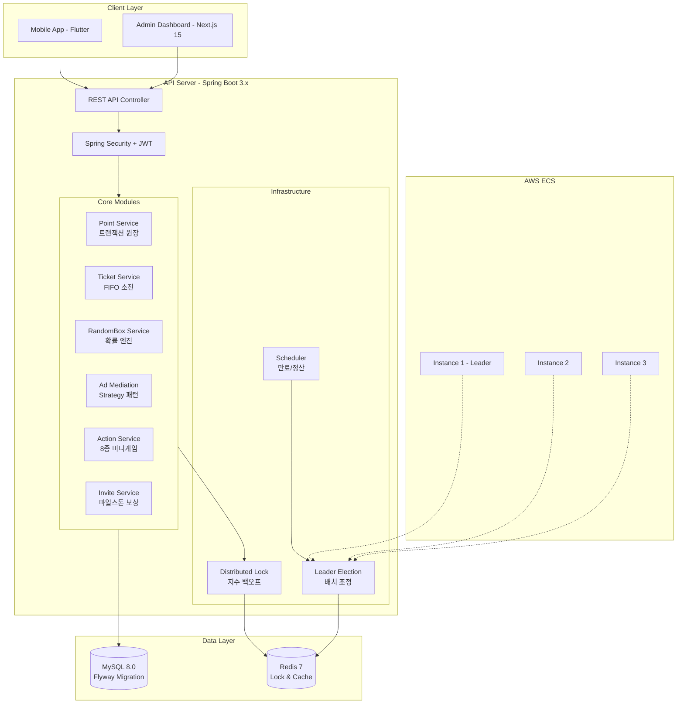
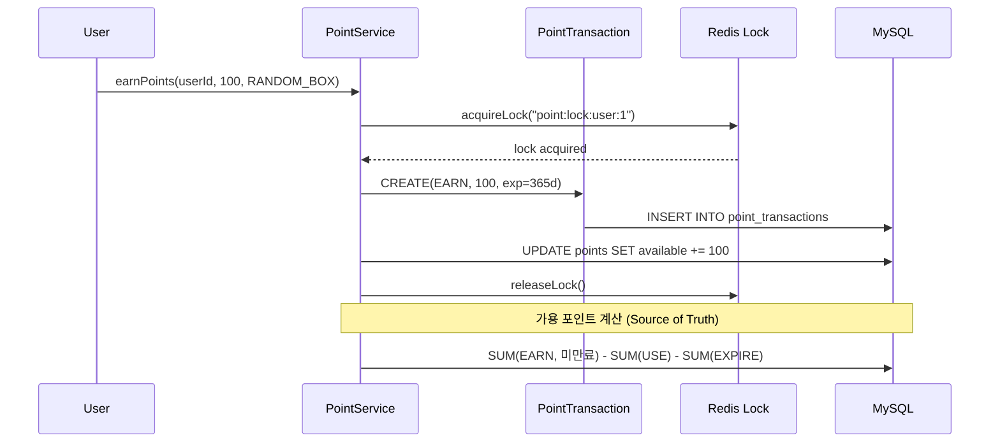
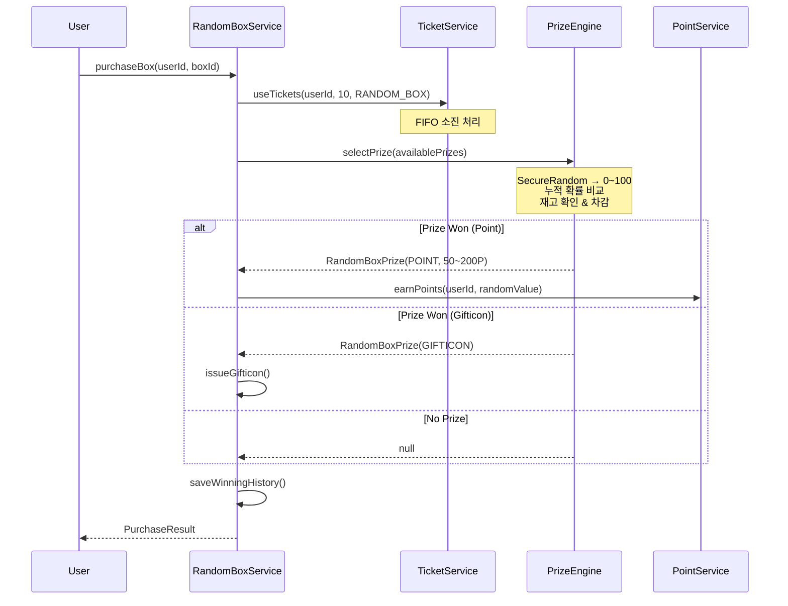
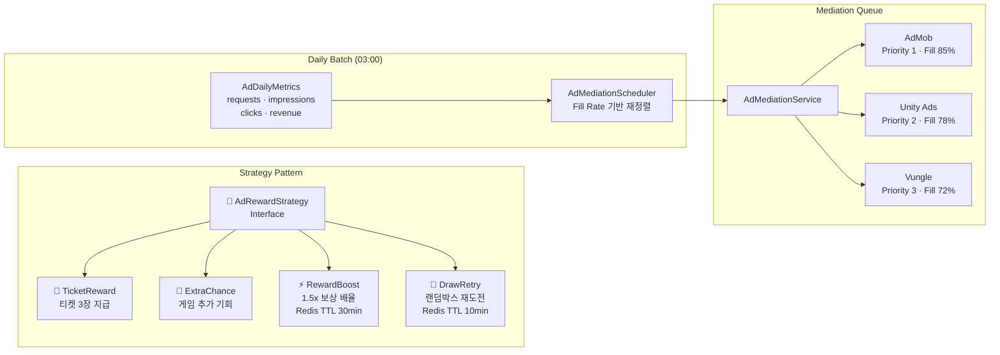
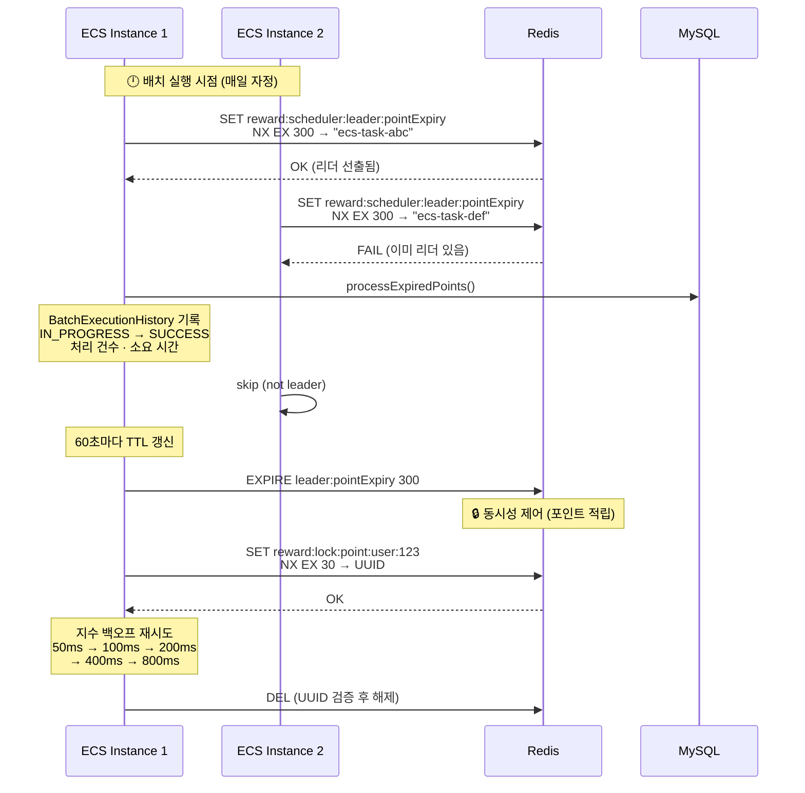

# Game Reward Platform API

[](https://github.com/HellCoding/reward-platform-api/actions/workflows/ci.yml)


게임 리워드 플랫폼의 핵심 백엔드 API 서버입니다.
이중 화폐 시스템, 확률 기반 상품 선택 엔진, 광고 미디에이션, 분산 락 등
**실제 프로덕션 환경에서 검증된 패턴**을 구현합니다.

## Why This Project?

기존 모놀리식 리워드 시스템에서 겪었던 문제들을 해결하기 위해 설계했습니다.

| Before | After |
|--------|-------|
| 단순 잔액 필드 관리 → 정합성 이슈 | **트랜잭션 원장 기반** 이중 화폐 시스템 |
| 하드코딩 광고 플랫폼 | **Strategy 패턴 + Fill Rate 기반** 동적 미디에이션 |
| 단일 인스턴스 배치 | **Redis 분산 락 + 리더 선출**로 다중 인스턴스 대응 |
| 포인트 동시 수정 충돌 | **지수 백오프 분산 락**으로 동시성 제어 |
| Math.random() 확률 | **SecureRandom + BigDecimal** 정밀 확률 엔진 |

## Architecture



## Key Features

### 1. 이중 화폐 시스템 (Dual Currency)

포인트(1차 화폐)와 티켓(2차 화폐)을 **트랜잭션 원장 패턴**으로 관리합니다.



**핵심 설계:**
- `PointTransaction`이 Source of Truth (원장)
- `Point.availableAmount`는 캐시 역할
- FIFO 기반 포인트 소진 (가장 오래된 적립부터 차감)
- 365일 기본 만료, 90일 비활성 사용자 만료
- `REPEATABLE_READ` 격리 수준으로 트랜잭션 정합성 보장

### 2. 확률 기반 상품 선택 엔진

`SecureRandom + BigDecimal` 정밀 연산으로 공정한 확률을 보장합니다.



**누적 확률 알고리즘:**
```
예: [A=30%, B=50%, C=20%]
 → 랜덤값 0~30 → A 당첨
 → 랜덤값 30~80 → B 당첨
 → 랜덤값 80~100 → C 당첨
 + 재고(remainingCount) 소진 시 해당 상품 skip
```

### 3. 광고 미디에이션 (Strategy Pattern)

3대 광고 플랫폼(AdMob, Unity Ads, Vungle)을 **Fill Rate 기반으로 동적 최적화**합니다.



**핵심 설계:**

- **Strategy 패턴**: `AdRewardStrategy` 인터페이스를 4종으로 구현하여 광고 시청 후 보상을 동적 분기
  - Spring `Map<String, AdRewardStrategy>` 자동 주입으로 런타임 전략 선택
- **Fill Rate 최적화**: `AdDailyMetrics`로 플랫폼별 일일 요청/노출/클릭/수익을 추적
  - `Fill Rate = impressions / requests × 100` — 높은 플랫폼이 높은 우선순위
  - 매일 새벽 3시 `AdMediationScheduler`가 `BatchExecutionManager`를 통해 리더 인스턴스에서만 실행
- **RewardBoost**: Redis에 TTL 30분으로 배율을 저장, 다음 게임 보상에 1.5x 적용
- **DrawRetry**: 랜덤박스 꽝 시 광고를 보면 1회 무료 재도전 토큰 발급 (Redis TTL 10분)

```
실제 최적화 예시:
  변경 전                          변경 후
  1. AdMob     (Fill Rate: 72%)    1. Unity Ads (Fill Rate: 88%) ← 승격
  2. Unity Ads (Fill Rate: 88%)    2. AdMob     (Fill Rate: 72%) ← 강등
  3. Vungle    (Fill Rate: 65%)    3. Vungle    (Fill Rate: 65%) ← 유지
```

### 4. Redis 분산 락 & 리더 선출

ECS Fargate 다중 인스턴스(2~4대) 환경에서 **동시성 제어**와 **배치 중복 실행 방지**를 구현합니다.



**핵심 설계:**

- **리더 선출 (`LeaderElectionService`)**: Redis `SET NX EX`로 하나의 인스턴스만 배치를 실행
  - TTL 5분, 60초마다 갱신하여 리더 유지
  - Redis 장애 시 인스턴스 이름 기반 결정론적 fallback
- **분산 락 (`DistributedLockManager`)**: 사용자별 포인트/티켓 수정 시 동시 접근 방지
  - `SET NX EX` + UUID 소유권 검증 — 다른 인스턴스의 락을 실수로 해제하지 않음
  - 지수 백오프: 50ms → 100ms → 200ms → 400ms → 800ms (최대 5회)
- **`@DistributedLock` AOP**: 어노테이션으로 선언적 락 관리, SpEL 동적 키 지원
  ```java
  @DistributedLock(name = "point", key = "#userId", leaseMs = 30000)
  public void earnPoints(Long userId, int amount) { ... }
  ```
- **Deadlock 재시도 (Ticket)**: MySQL Deadlock 감지 시 `CannotAcquireLockException` → 지수 백오프 3회 (200ms → 400ms → 800ms)
- **배치 관리 (`BatchExecutionManager`)**: 리더 확인 + 중복 실행 방지 + `BatchExecutionHistory`에 실행 결과 자동 기록

| 배치 작업 | 스케줄 | 내용 |
|----------|--------|------|
| `point-expiration` | 매일 00:00 | 만료 포인트 EXPIRE 트랜잭션 생성 |
| `inactive-user-expiration` | 매일 00:30 | 90일 미접속 사용자 포인트 만료 |
| `ad-mediation-optimization` | 매일 03:00 | Fill Rate 기반 광고 우선순위 재정렬 |

### 5. 게임 액션 시스템

8종 미니게임의 일일 참여 제한, 보상 상한, 이벤트 배율을 관리합니다.

| Game | Type | Success | Fail | Daily Limit |
|------|------|---------|------|-------------|
| 출석 체크 | ATTENDANCE | 3T | 0 | 1회 |
| 가위바위보 | RPS | 2T | 1T | 10회 |
| 그림 맞추기 | PICTURE_MATCHING | 3T | 1T | 5회 |
| 럭키 룰렛 | ROULETTE | 5T | 0 | 3회 |
| 스톱워치 | STOPWATCH | 2T | 0 | 5회 |
| 고양이 찾기 | FIND_CAT | 3T | 1T | 5회 |
| 광고 시청 | AD_REWARDED | 3T | 0 | 10회 |
| 오목 | OMOK | 5T | 1T | 3회 |

### 6. 친구 초대 시스템

마일스톤 기반 추가 보상과 **별도 트랜잭션 격리**로 안정성을 확보합니다.

```
초대 코드 사용 Flow:
├─ 코드 유효성 검증
├─ 중복 초대 방지
├─ 양방향 보상 지급 (초대자 + 피초대자)
└─ 마일스톤 체크 (@Transactional(REQUIRES_NEW))
   └─ 5명 단위 마일스톤 보상 (실패해도 초대 롤백 안함)
```

## Tech Stack

| Category | Technology |
|----------|-----------|
| **Language** | Java 17 |
| **Framework** | Spring Boot 3.3.4, Spring Security, Spring Data JPA |
| **Database** | MySQL 8.0, Flyway Migration |
| **Cache/Lock** | Redis 7 (Lettuce), Caffeine |
| **Auth** | JWT (JJWT 0.11.5), OAuth2 (Kakao, Apple) |
| **API Docs** | SpringDoc OpenAPI 3.0 (Swagger UI) |
| **Monitoring** | Prometheus, Micrometer, Spring Actuator |
| **Resilience** | Resilience4j, Distributed Lock, Exponential Backoff |
| **Build** | Gradle 8.10, GitHub Actions CI/CD |
| **Deploy** | Docker, AWS ECS Fargate |

## Project Structure

```
src/main/java/com/rewardplatform/
├── point/
│   ├── service/        # 트랜잭션 원장 기반 포인트 관리
│   ├── scheduler/      # 만료 배치 (BatchExecutionManager 연동)
│   └── domain/         # Point, PointTransaction (Source of Truth)
├── ticket/
│   └── service/        # FIFO 소진 + Deadlock 재시도 + Event Listener
├── randombox/
│   └── service/        # SecureRandom + BigDecimal 확률 엔진
├── ad/
│   ├── service/        # Strategy 패턴 4종 (Ticket, ExtraChance, Boost, DrawRetry)
│   ├── scheduler/      # Fill Rate 기반 미디에이션 최적화 배치
│   └── domain/         # AdPlatform, AdDailyMetrics
├── action/             # 8종 미니게임 (일일 제한, 보상 상한)
├── invite/             # 친구 초대 (마일스톤, REQUIRES_NEW 격리)
├── user/               # JWT + OAuth2 (Kakao, Apple)
├── common/
│   ├── lock/           # @DistributedLock AOP, LeaderElectionService
│   ├── batch/          # BatchExecutionManager, BatchExecutionHistory
│   ├── event/          # InviteRewardEvent, ActionCompletedEvent
│   └── util/           # DistributedLockManager, AbstractPrizeSelector
└── config/             # Security, Redis, Scheduler
```

## Quick Start

### Prerequisites
- Java 17+
- Docker & Docker Compose

### Run with Docker Compose
```bash
# Build & Run
./gradlew build -x test
docker-compose up -d

# API 확인
curl http://localhost:8080/actuator/health

# Swagger UI
open http://localhost:8080/swagger-ui.html
```

### Run Locally
```bash
# MySQL & Redis 실행 (Docker)
docker-compose up -d mysql redis

# Application 실행
./gradlew bootRun

# Tests
./gradlew test
```

## API Endpoints

| Method | Endpoint | Description |
|--------|----------|-------------|
| GET | `/api/points/{userId}/status` | 포인트 현황 (원장 기반) |
| GET | `/api/points/{userId}/transactions` | 트랜잭션 이력 |
| GET | `/api/actions/{userId}/available` | 참여 가능 게임 목록 |
| POST | `/api/actions/{userId}/play` | 게임 플레이 + 보상 |
| GET | `/api/random-boxes` | 랜덤박스 목록 |
| POST | `/api/random-boxes/{boxId}/purchase` | 박스 구매 (확률 선택) |
| GET | `/api/ads/mediation?type=REWARDED` | 광고 미디에이션 |
| POST | `/api/ads/complete` | 광고 시청 완료 + 보상 |
| GET | `/api/invites/{userId}/code` | 초대 코드 조회 |
| POST | `/api/invites/{userId}/redeem?code=XXX` | 코드 사용 |

## Technical Deep Dive

자세한 기술 문서는 [docs/](docs/) 디렉토리를 참고하세요.

- [01-dual-currency-system.md](docs/01-dual-currency-system.md) — 트랜잭션 원장 기반 이중 화폐
- [02-probability-engine.md](docs/02-probability-engine.md) — SecureRandom 확률 엔진
- [03-ad-mediation.md](docs/03-ad-mediation.md) — Strategy 패턴 광고 미디에이션
- [04-distributed-lock.md](docs/04-distributed-lock.md) — Redis 분산 락 & 리더 선출
- [05-ecs-deployment.md](docs/05-ecs-deployment.md) — ECS 배포 전략

## Performance

| Metric | Value |
|--------|-------|
| 회원 수 | 1,500+ |
| 일 평균 티켓 발행 | 4,000장 |
| 일 평균 포인트 발행 | 30,000P |
| ECS 인스턴스 | 최소 2대 → 최대 4대 (Auto Scaling) |
| API 응답 시간 (p95) | < 200ms |

## License

This project is for portfolio purposes.
