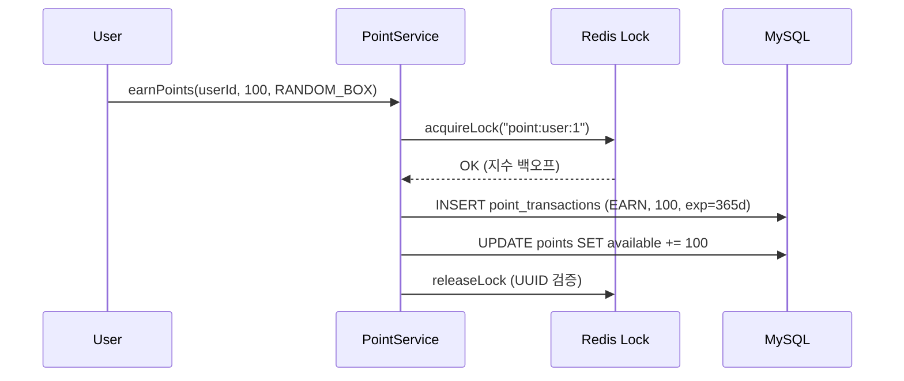

# 이중 화폐 시스템 (Dual Currency System)

## 개요

게임 리워드 플랫폼에서 **포인트(1차 화폐)**와 **티켓(2차 화폐)**을 트랜잭션 원장 패턴으로 관리합니다.

| 화폐 | 용도 | 획득 경로 | 소비 |
|------|------|----------|------|
| **Ticket** | 게임 참여권 | 게임 액션, 광고 시청, 초대 | 랜덤박스 구매 |
| **Point** | 현금성 보상 | 랜덤박스, 이벤트, 초대 | 기프티콘 교환 |

## 핵심 설계: 트랜잭션 원장 (Transaction Ledger)

### 문제

기존 방식은 `balance` 필드를 직접 증감하여 정합성 이슈가 발생했습니다:

```
# Anti-pattern: 잔액 직접 조작
UPDATE points SET balance = balance + 100 WHERE user_id = 1;
→ 동시 수정 시 Lost Update 발생 가능
→ 변동 이력 추적 불가
→ 만료 처리 시 원래 적립분 역추적 어려움
```

### 해결: Source of Truth = PointTransaction

```
가용 포인트 = SUM(EARN, 미만료) - SUM(USE) - SUM(EXPIRE)
```

`Point.availableAmount`는 캐시 역할이며, `PointTransaction` 테이블이 진짜 잔액의 원천입니다.



### FIFO 기반 포인트 소진

가장 오래된 적립부터 차감하여 만료 정책과 일관성을 유지합니다:

```java
// 포인트 사용 시 FIFO 소진 로직
int remaining = amount;
List<PointTransaction> earnTxList = findActiveEarnTransactions(userId);

for (PointTransaction earnTx : earnTxList) {
    if (remaining <= 0) break;
    int consume = Math.min(remaining, earnTx.getAmount());
    earnTx.deactivate();
    remaining -= consume;
}
```

### 티켓 FIFO: remainingAmount 추적

티켓은 부분 소진을 지원합니다. 각 EARN 트랜잭션의 `remainingAmount`를 추적하여 정확한 소진이 가능합니다:

```
EARN(10장, remaining=10) → USE(3장) → remaining=7
EARN(5장, remaining=5)  → USE(8장) → EARN#1: remaining=0, EARN#2: remaining=4
```

## 만료 정책

| 정책 | 기간 | 배치 시간 |
|------|------|----------|
| 기본 만료 | 적립 후 365일 | 매일 00:00 |
| 비활성 만료 | 최종 접속 후 90일 | 매일 00:30 |

## 동시성 제어

```
Redis 분산 락 (사용자별)
├── 키: reward:lock:point:user:{userId}
├── TTL: 30초
├── 소유권: UUID 검증
└── 재시도: 지수 백오프 (50ms → 100ms → 200ms → 400ms → 800ms)
```

### 트랜잭션 격리 수준

- **포인트 적립**: `@Transactional` (기본 격리)
- **포인트 사용**: `@Transactional(isolation = REPEATABLE_READ)` — Phantom Read 방지
