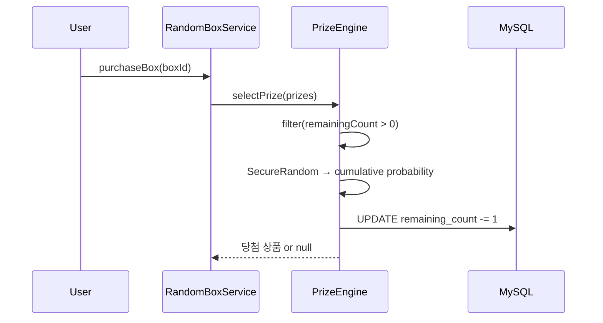

# 확률 기반 상품 선택 엔진 (Probability Engine)

## 개요

랜덤박스 구매 시 `SecureRandom + BigDecimal` 기반으로 공정한 확률을 보장하는 상품 선택 엔진입니다.

## 왜 Math.random()을 사용하지 않는가?

| | Math.random() | SecureRandom |
|---|---|---|
| 예측 가능성 | 시드 추측 시 예측 가능 | 암호학적 안전 |
| 정밀도 | double 부동소수점 오차 | BigDecimal 정밀 연산 |
| 용도 | 일반 로직 | 금전 관련 확률 |

## 누적 확률 알고리즘

```
예: [상품A=30%, 상품B=50%, 상품C=20%]

SecureRandom → 0~100 사이 랜덤값 생성

  0 ━━━━━━━━━━━ 30 ━━━━━━━━━━━━━━━━━━━━ 80 ━━━━━━━━━━━ 100
  |    상품A     |         상품B          |    상품C     |

  랜덤값 25.3 → 상품A 당첨
  랜덤값 65.7 → 상품B 당첨
  랜덤값 95.1 → 상품C 당첨
```

### 구현: AbstractPrizeSelector

```java
public abstract class AbstractPrizeSelector<T> {
    private final SecureRandom secureRandom = new SecureRandom();

    public T selectPrize(List<T> candidates) {
        // 1. 재고 있는 상품만 필터링
        List<T> available = candidates.stream()
                .filter(c -> getRemainingCount(c) > 0)
                .toList();

        if (available.isEmpty()) return null;

        // 2. SecureRandom으로 0~100 사이 값 생성
        BigDecimal randomValue = BigDecimal.valueOf(secureRandom.nextDouble())
                .multiply(BigDecimal.valueOf(100))
                .setScale(6, RoundingMode.HALF_UP);

        // 3. 누적 확률 비교
        BigDecimal cumulative = BigDecimal.ZERO;
        for (T candidate : available) {
            cumulative = cumulative.add(getProbability(candidate));
            if (randomValue.compareTo(cumulative) <= 0) {
                decrementStock(candidate);
                return candidate;
            }
        }

        return null; // 꽝
    }
}
```

### 재고 관리



## 포인트 보상 범위

상품이 포인트 타입인 경우, `minPointValue~maxPointValue` 범위에서 랜덤 포인트를 지급합니다:

```java
if (prize.getMinPointValue() != null && prize.getMaxPointValue() != null) {
    int range = prize.getMaxPointValue() - prize.getMinPointValue();
    int pointReward = prize.getMinPointValue() + secureRandom.nextInt(range + 1);
    pointService.earnPoints(userId, pointReward, RANDOM_BOX, ...);
}
```

## 확률 검증

테스트에서 대량 시뮬레이션으로 확률 분포를 검증합니다:

```
10,000회 시뮬레이션 결과:
- 상품A (30%): 29.87% (오차 0.13%)
- 상품B (50%): 50.23% (오차 0.23%)
- 상품C (20%): 19.90% (오차 0.10%)
→ 허용 오차 범위(±2%) 이내 통과
```
