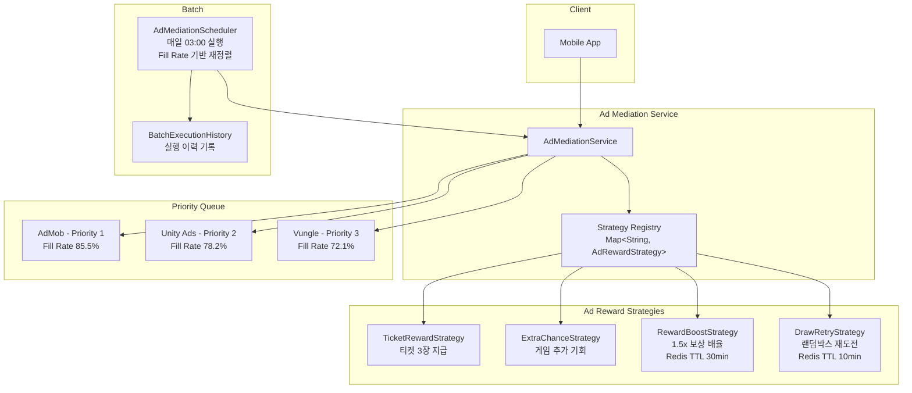

# 광고 미디에이션 시스템 (Ad Mediation)

## 개요

3대 광고 플랫폼(AdMob, Unity Ads, Vungle)을 **Strategy 패턴 + Fill Rate 기반 동적 미디에이션**으로 최적화합니다.

## 아키텍처



## Strategy 패턴 보상 분기

```java
public interface AdRewardStrategy {
    void applyReward(Long userId, String adPlatform);
    String getRewardType();
}
```

Spring의 `Map<String, Bean>` 자동 주입을 활용하여 Strategy를 런타임에 동적 선택합니다:

```java
// Spring이 자동으로 모든 AdRewardStrategy 구현체를 Map으로 주입
private final Map<String, AdRewardStrategy> rewardStrategies;

public void processAdCompletion(Long userId, Long platformId, String rewardType) {
    AdRewardStrategy strategy = rewardStrategies.get(rewardType.toLowerCase() + "RewardStrategy");
    strategy.applyReward(userId, platformName);
}
```

## Fill Rate 기반 우선순위 최적화

### 메트릭 수집

`AdDailyMetrics` 엔티티로 플랫폼별 일일 메트릭을 추적합니다:

| 메트릭 | 설명 | 계산식 |
|--------|------|--------|
| Fill Rate | 광고 노출 성공률 | impressions / requests * 100 |
| CTR | 클릭률 | clicks / impressions * 100 |
| eCPM | 1,000회 노출당 수익 | revenue / impressions * 1000 |

### 배치 최적화 로직

매일 새벽 3시에 `AdMediationScheduler`가 실행됩니다:

```
1. 전일 AdDailyMetrics 조회
2. 플랫폼별 Fill Rate 업데이트
3. Fill Rate 내림차순 정렬
4. 우선순위 재배정 (1, 2, 3...)
5. BatchExecutionHistory에 결과 기록
```

### 실제 최적화 예시

```
변경 전:
  1. AdMob     (Fill Rate: 72%)
  2. Unity Ads (Fill Rate: 88%)
  3. Vungle    (Fill Rate: 65%)

배치 실행 후:
  1. Unity Ads (Fill Rate: 88%) ← 승격
  2. AdMob     (Fill Rate: 72%) ← 강등
  3. Vungle    (Fill Rate: 65%) ← 유지
```

## RewardBoostStrategy 상세

Redis에 TTL 30분으로 boost 상태를 저장하여, 다음 게임 보상에 1.5배 배율을 적용합니다:

```
광고 시청 → Redis SET reward:boost:user:123 "1.5" EX 1800
→ 30분 내 게임 플레이 시 ActionService가 boost 확인
→ 티켓 보상 * 1.5 적용
```
