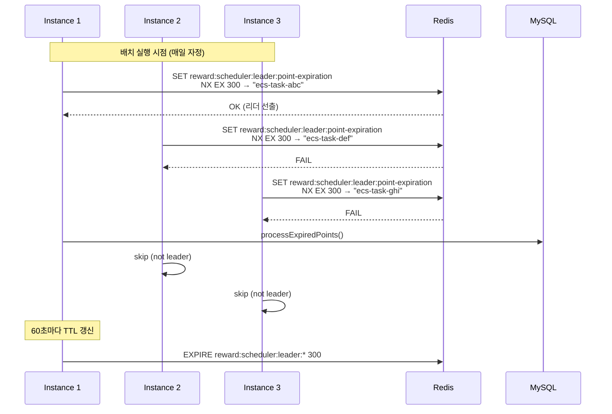

# Redis 분산 락 & 리더 선출 (Distributed Lock & Leader Election)

## 개요

ECS Fargate 다중 인스턴스 환경에서 **동시성 제어**와 **배치 중복 실행 방지**를 위한 Redis 기반 분산 락 시스템입니다.

## 1. 분산 락 (DistributedLockManager)

### 문제

ECS에서 최소 2대 ~ 최대 4대 인스턴스가 동시에 동일한 사용자의 포인트를 수정할 수 있습니다:

```
Instance 1: READ balance=100 → balance + 50 = 150 → WRITE 150
Instance 2: READ balance=100 → balance + 30 = 130 → WRITE 130  ← Lost Update!
```

### 해결: Redis SET NX EX + 지수 백오프

```java
// SET NX EX: 원자적 락 획득
SET reward:lock:point:user:123 "uuid-abc" NX EX 30

// 지수 백오프 재시도
attempt 1: wait 50ms
attempt 2: wait 100ms
attempt 3: wait 200ms
attempt 4: wait 400ms
attempt 5: wait 800ms (max)
```

### 소유권 검증

```java
// 락 해제 시 UUID 검증 → 다른 인스턴스의 락을 실수로 해제하지 않음
private void releaseLock(String key, String expectedValue) {
    String currentValue = redisTemplate.opsForValue().get(key);
    if (expectedValue.equals(currentValue)) {
        redisTemplate.delete(key);
    }
}
```

## 2. @DistributedLock AOP 어노테이션

수동 락 관리 대신 어노테이션으로 선언적 사용이 가능합니다:

```java
@DistributedLock(name = "point", key = "#userId", leaseMs = 30000)
public void earnPoints(Long userId, int amount) {
    // Aspect가 자동으로:
    // 1. 락 획득 (지수 백오프)
    // 2. 메서드 실행
    // 3. 락 해제 (UUID 검증)
}
```

### SpEL 동적 키 해석

```java
// @DistributedLock(name = "ticket", key = "#userId")
// userId = 123 → 락 키: "ticket:123"

EvaluationContext context = new StandardEvaluationContext();
context.setVariable("userId", 123);
Object resolved = parser.parseExpression("#userId").getValue(context);
// → 락 키: "reward:lock:ticket:123"
```

## 3. 리더 선출 (LeaderElectionService)

### 배치 중복 실행 문제

ECS 4대 인스턴스가 동시에 `@Scheduled(cron = "0 0 0 * * *")` 배치를 실행하면 포인트가 4번 만료 처리됩니다.

### 해결: Redis 기반 리더 선출



### Redis 장애 시 Fallback

Redis가 응답하지 않을 때, 인스턴스 이름 기반 결정론적 선출로 fallback합니다:

```java
private boolean fallbackLeaderElection() {
    String hostname = System.getenv("HOSTNAME");
    if (hostname == null) {
        return true; // 로컬 환경 → 항상 리더
    }
    return true; // ECS → 첫 번째 태스크가 리더
}
```

## 4. 배치 실행 관리 (BatchExecutionManager)

리더 선출 + 중복 실행 방지 + 실행 이력을 통합 관리합니다:

```
BatchExecutionManager.executeIfLeader("point-expiration", 300000, () -> {
    // 1. LeaderElectionService로 리더 확인
    // 2. 금일 이미 성공 실행이 있는지 확인
    // 3. BatchExecutionHistory IN_PROGRESS 기록
    // 4. 배치 로직 실행
    // 5. SUCCESS/FAIL 기록 (처리 건수, 소요 시간)
});
```

### BatchExecutionHistory 기록 예시

| job_name | status | instance_id | processed | time |
|----------|--------|-------------|-----------|------|
| point-expiration | SUCCESS | ecs-task-abc | 47 | 1,234ms |
| inactive-user-expiration | SUCCESS | ecs-task-abc | 3 | 567ms |
| ad-mediation-optimization | SUCCESS | ecs-task-abc | 2 | 89ms |

## 5. Deadlock 재시도 (Ticket Service)

티켓 시스템에서 MySQL Deadlock 발생 시 지수 백오프로 자동 재시도합니다:

```
attempt 1: execute → Deadlock detected → wait 200ms
attempt 2: execute → Deadlock detected → wait 400ms
attempt 3: execute → SUCCESS
```

```java
private <T> T executeWithDeadlockRetry(Supplier<T> task) {
    int retryCount = 0;
    while (true) {
        try {
            return task.get();
        } catch (CannotAcquireLockException e) {
            retryCount++;
            if (retryCount >= MAX_RETRIES) throw e;
            Thread.sleep(200 * (1L << retryCount)); // 200ms, 400ms, 800ms
        }
    }
}
```
